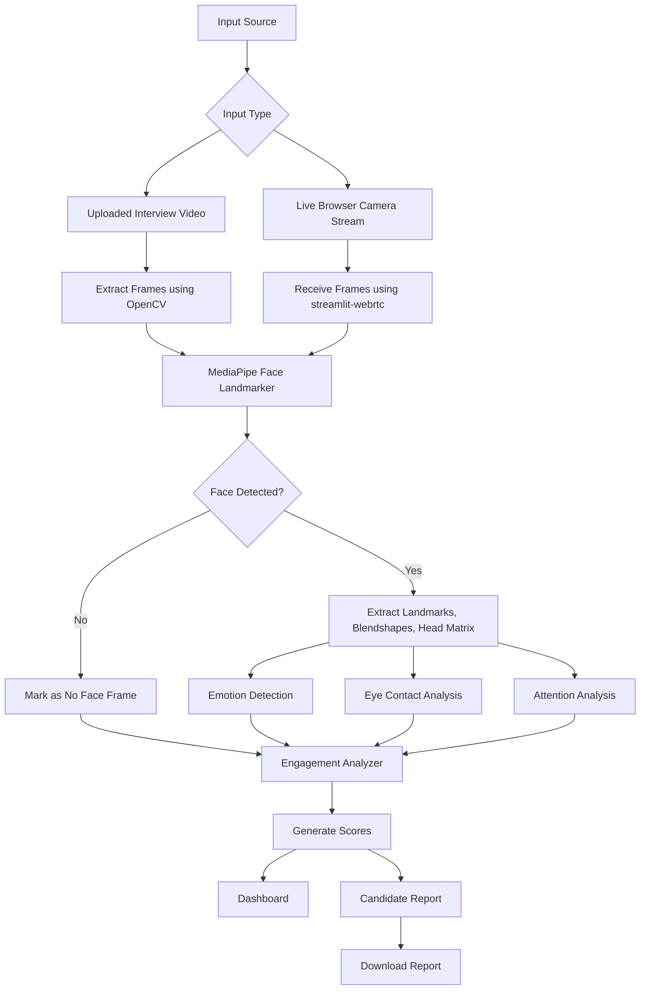
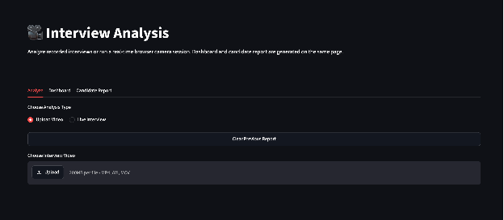
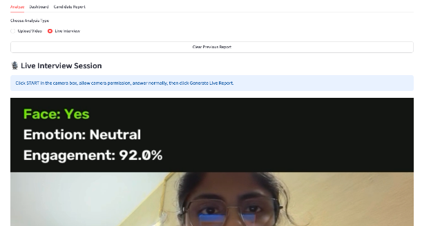
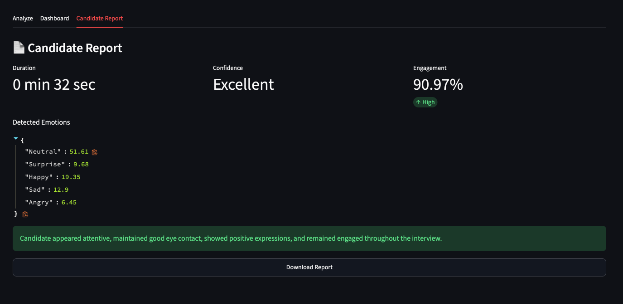

# Interview Analysis

Streamlit application for analyzing interview videos and real-time browser camera interview sessions with face landmarks, blendshape-based emotion detection, eye contact, attention, and engagement scoring.

The UI is kept in one simple `app.py` file. The analysis logic is separated into small modules so the code is easier to understand.

## Run

```bash
pip install -r requirements.txt
streamlit run app.py
```

## Project Structure

- `app.py` - complete Streamlit UI
- `modules/` - face detection, emotion detection, engagement, video, live stream processing, and report generation
- `uploads/` - sample interview video
- `model/` - MediaPipe face landmarker model

# Interview Analysis System

## 1. Abstract

The Interview Analysis System is a Python-based application designed to analyze candidate behavior during interviews using computer vision and facial analysis. The system supports both uploaded interview videos and real-time live interview sessions through a browser camera. It detects facial landmarks, facial expressions, eye contact, attention, face visibility, and overall engagement.

The project uses Streamlit for the user interface, OpenCV for video processing, MediaPipe Face Landmarker for facial landmark and blendshape detection, streamlit-webrtc for real-time browser camera streaming, Pandas for data handling, and Plotly for dashboard visualization. The final output is a candidate report containing emotion distribution, engagement score, confidence level, and a final recommendation.

## 2. Introduction

Interviews are an important part of recruitment and candidate evaluation. Apart from verbal answers, non-verbal behavior such as eye contact, facial expressions, attention, and confidence also plays an important role in assessing communication skills and engagement.

Manual evaluation of these factors can be subjective and inconsistent. This project provides an AI-assisted system that analyzes visual behavior during an interview and presents the result in a structured and easy-to-understand format.

The system is not intended to replace human interviewers. Instead, it acts as a supporting tool that provides additional behavioral insights.

## 3. Problem Statement

Traditional interview evaluation depends heavily on human observation. Important behavioral signals such as eye contact, facial expression, and attention may be missed or judged differently by different interviewers.

The problem addressed by this project is:

To develop a Python-based system that can analyze interview videos and live interview sessions, detect candidate facial behavior, calculate engagement-related scores, and generate a structured report.

## 4. Objectives

- To analyze uploaded interview videos.
- To support real-time live interview analysis using a browser camera.
- To detect face presence using MediaPipe.
- To identify emotions using facial blendshape scores.
- To estimate eye contact using eye landmarks.
- To estimate attention using head pose information.
- To calculate an overall engagement score.
- To display results through a professional dashboard.
- To generate a downloadable candidate report.

## 5. Existing System

In many interview processes, candidate evaluation is done manually by recruiters or interviewers. The interviewer observes the candidate and makes judgments based on answers, confidence, facial expressions, and body language.

Limitations of the existing system:

- Evaluation may be subjective.
- Non-verbal behavior may not be recorded properly.
- It is difficult to compare multiple candidates consistently.
- Interviewers may miss details during long interviews.
- Manual reporting takes time.

## 6. Proposed System

The proposed system analyzes interview videos or live camera sessions automatically. It extracts frames from the video or receives frames from the browser camera stream. Each frame is processed using MediaPipe Face Landmarker.

The system detects:

- Face visibility
- Facial landmarks
- Facial blendshapes
- Head pose
- Emotion
- Eye contact
- Attention
- Overall engagement

The final result is shown in a dashboard and candidate report. The report can also be downloaded in JSON format.

## 7. Technology Stack

| Component | Technology Used |
|---|---|
| Programming Language | Python |
| User Interface | Streamlit |
| Video Processing | OpenCV |
| Face Landmark Detection | MediaPipe Face Landmarker |
| Live Camera Streaming | streamlit-webrtc |
| Frame Handling | PyAV |
| Data Handling | Pandas |
| Visualization | Plotly |
| Report Format | JSON |

## 8. System Architecture



## 9. Module Description

### 9.1 app.py

The `app.py` file contains the Streamlit user interface. It provides three main sections:

- Analyze
- Dashboard
- Candidate Report

The Analyze section allows the user to choose between uploaded video analysis and live interview analysis.

### 9.2 face_detector.py

This module uses MediaPipe Face Landmarker to detect faces in each frame. It returns:

- Face detection status
- Facial landmarks
- Facial blendshape values
- Facial transformation matrix

### 9.3 emotion_detector.py

This module detects emotions using facial blendshape scores. It calculates emotion scores based on facial movements such as smile, frown, brow movement, jaw opening, eye widening, cheek squint, and nose sneer.

Detected emotions include:

- Happy
- Neutral
- Sad
- Angry
- Fear
- Surprise
- Disgust

### 9.4 engagement.py

This module calculates engagement-related scores:

- Eye contact score
- Attention score
- Face visibility score
- Overall engagement score

The engagement score is calculated using weighted scoring.

### 9.5 video_processor.py

This module handles uploaded video files. It opens the video using OpenCV, reads video information, calculates duration, and extracts frames for analysis.

### 9.6 live_processor.py

This module handles live interview analysis. It receives frames from the browser camera stream using streamlit-webrtc. Each frame is analyzed in real time, and live status is shown on the camera feed.

### 9.7 report_generator.py

This module generates the final candidate report. It calculates emotion percentages, confidence level, engagement level, and final recommendation.

## 10. Algorithm and Workflow

### Uploaded Video Workflow

1. User uploads an interview video.
2. The system saves the video temporarily.
3. OpenCV reads the video file.
4. Frames are extracted from the video.
5. Each frame is sent to MediaPipe Face Landmarker.
6. If a face is detected, landmarks and blendshapes are extracted.
7. Emotion is detected using blendshape scores.
8. Eye contact is estimated using eye landmarks.
9. Attention is estimated using head pose values.
10. Engagement score is calculated.
11. Dashboard and candidate report are generated.

### Live Interview Workflow

1. User selects Live Interview.
2. User starts the browser camera.
3. streamlit-webrtc receives live video frames.
4. Frames are passed to the live processor.
5. MediaPipe analyzes facial landmarks and blendshapes.
6. Live overlay displays face status, emotion, and engagement.
7. User clicks Generate Live Report.
8. Final report is generated from analyzed live frames.

## 11. Scoring Logic

The system calculates overall engagement using three major factors:

```text
Engagement Score =
Eye Contact Score * 0.4
+ Attention Score * 0.4
+ Face Visibility Score * 0.2
```

### Eye Contact Score

Eye contact is estimated using the position of eye landmarks. If the eyes are near the center region, the system considers it as eye contact.

### Attention Score

Attention is estimated using the facial transformation matrix. If the head pose is close to the front-facing direction, the system considers the candidate attentive.

### Face Visibility Score

Face visibility is calculated based on how many frames contain a detected face.

## 12. Implementation Details

The project is implemented using Python. Streamlit is used to build the user interface because it allows fast development of interactive data applications. OpenCV is used to process video frames. MediaPipe Face Landmarker is used because it provides facial landmarks, blendshapes, and transformation matrices.

For live interview analysis, the project uses streamlit-webrtc. This allows the application to access the browser camera and process video frames in real time.

The final result is stored in Streamlit session state and displayed in the Dashboard and Candidate Report sections.

## 13. Result and Output

The system produces the following outputs:

- Eye Contact Score
- Attention Score
- Face Visibility Score
- Overall Engagement Score
- Overall Engagement Level
- Confidence Level
- Emotion Distribution
- Final Recommendation
- Downloadable JSON Report

The dashboard contains metric cards and charts for emotion distribution. The candidate report contains a summary of interview duration, engagement, confidence, emotions, and recommendation.

## 📸 Screenshots

<table>
<tr>
<td align="center">
<b>Home Screen</b><br>

</td>


<td align="center">
<b>Prediction Result</b><br>

</td>
</tr>

<tr>
<td align="center">
<b>Graphs</b><br>

</td>

<td align="center">
<b>Prediction Result</b><br>

</td>
</tr>
</table>

## 14. Advantages

- Easy-to-use web interface.
- Supports both video upload and live interview analysis.
- Uses real-time browser camera streaming.
- Provides visual dashboard and structured report.
- Helps reduce manual effort in behavioral observation.
- Makes candidate evaluation more consistent.
- Built fully using Python.

## 15. Limitations

- Emotion detection is based on facial blendshape rules, not a separately trained emotion model.
- Lighting, camera quality, and face angle can affect accuracy.
- Eye contact estimation is approximate.
- The system analyzes visual behavior only and does not evaluate spoken answers.
- It should be used as a supporting tool, not as the only basis for hiring decisions.

## 16. Future Scope

- Add speech-to-text transcription.
- Analyze voice confidence and speaking clarity.
- Generate PDF reports.
- Store reports in a database.
- Add login system for recruiters.
- Add candidate-wise history and comparison.
- Improve emotion detection using a trained deep learning model.
- Add question-wise interview scoring.
- Add distraction detection.
- Add admin dashboard for multiple candidates.

## 17. Conclusion

The Interview Analysis System provides an AI-assisted approach for analyzing candidate behavior during interviews. It combines computer vision, facial landmark detection, live video streaming, data visualization, and report generation.

The project successfully analyzes uploaded videos and live interview sessions. It detects emotions, eye contact, attention, face visibility, and engagement. The generated dashboard and report help users understand candidate behavior in a structured way.

This system can be further improved by adding speech analysis, PDF reports, database storage, and more advanced machine learning models.

```
